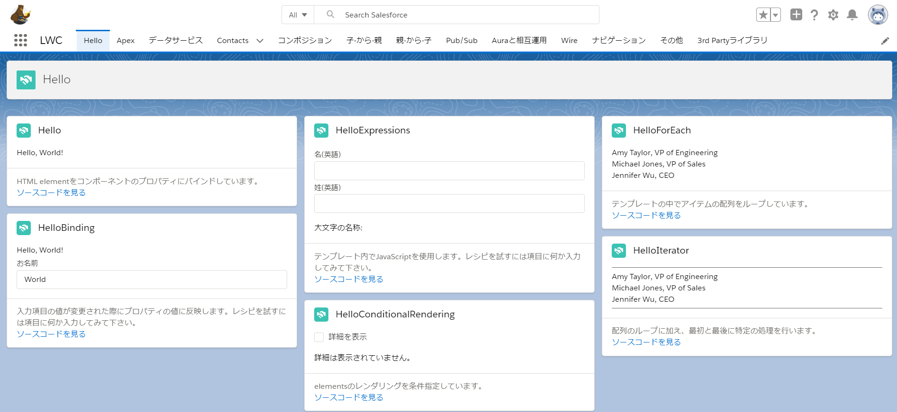

# Lightning Web Components レシピ
<!--
[](https://circleci.com/gh/trailheadapps-jp/lwc-recipes-jp)
-->

## This is Localized Repository. Original is here.
https://github.com/trailheadapps/lwc-recipes


Lightning Web Componentsの簡単なコードサンプル集を提供します。 それぞれのレシピは特定のタスクについて30行弱程度のコードで構築されています。ソースの表示リンクでGithubのコードを参照できます。Hello Worldからサードパーティのライブラリやデータアクセスまで、豊富なレシピがあります！



## 目次
- [インストール手順](#インストール手順)
- [Salesforce DXを使ったレシピのインストール](#Salesforce-DXを使ったレシピのインストール)
- [ロック解除済みパッケージを使ったレシピのインストール](#ロック解除済みパッケージを使ったレシピのインストール)
- [追加のインストール手順](#追加のインストール手順)
- [ユースケース別コンポーネントへのリンク](#ユースケース別コンポーネントへのリンク)

## インストール手順

Lightning Web Components レシピには2種類のインストール方法があります。:

- [Salesforce DXを利用](#salesforce-dxを使ったレシピのインストール): 推奨する手順です。開発者でアプリとコードを詳しく知りたい方はこちらを利用してください。
- [ロック解除済みパッケージを利用](#ロック解除済みパッケージを使ったレシピのインストール): このオプションはローカルの開発環境のインストール無しに誰でもサンプルアプリを試すことができます。

## Salesforce DXを使ったレシピのインストール

1. 環境をセットアップします。 [Quick Start: Lightning Web Components](https://trailhead.salesforce.com/content/learn/projects/quick-start-lightning-web-components/) Trailhead プロジェクトのステップに従います。このステップには以下が含まれます:

  - Trailhead Playgroundで、Dev Hubを有効化する
  - Salesforce CLI のインストール
  - Visual Studio Codeのインストール
  - Lightning Web Components extensionを含む、Visual Studio Code Salesforce extensionsのインストール

2. まだ実施していない場合にはHub組織に認証しエイリアスを設定します(以下のコマンドでは **myhuborg** と設定):

  ```
  sfdx force:auth:web:login -d -a myhuborg
  ```

3. lwc-recipes-jp リポジトリをCloneします:

  ```
  git clone https://github.com/trailheadapps-jp/lwc-recipes-jp
  cd lwc-recipes-jp
  ```

4. スクラッチ組織を生成し、エイリアスを設定します (**lwc-recipes-jp** を以下のコマンドラインでは使用):

  ```
  sfdx force:org:create -s -f config/project-scratch-def.json -a lwc-recipes-jp
  ```

5. アプリをスクラッチ組織にPushします:

  ```
  sfdx force:source:push
  ```

6. **recipes** 権限セットをデフォルトユーザにアサインします:

  ```
  sfdx force:user:permset:assign -n recipes
  ```

7. サンプルデータをロードします:

  ```
  sfdx force:data:tree:import --plan ./data/data-plan.json
  ```

8. スクラッチ組織を開きます:

  ```
  sfdx force:org:open
  ```

9. **設定** ページから, **テーマおよびブランド設定** で **Recipes Lite** もしくは **Recipes Blue** テーマを有効にします。

10. アプリケーションランチャーより、 **LWC** アプリを選択します。

## ロック解除済みパッケージを使ったレシピのインストール

※注: この方法でインストールされるパッケージは **英語版** です。

1. [サインアップ](https://developer.salesforce.com/signup) からDeveloper Edition組織を取得します。

2. 私のドメインをDEで有効化にします。この手順はの詳細は[こちら](https://trailhead.salesforce.com/modules/identity_login/units/identity_login_my_domain)にあります。

3. [このリンク](https://login.salesforce.com/packaging/installPackage.apexp?p0=04tB0000000KAfTIAW) をクリックし、レシピのロック解除済みパッケージをDE組織にインストールします。

4. **すべてのユーザのインストール** を選択します。

5. 取引先及び取引先責任者のデータをインポートします:

  - [こちら](https://raw.githubusercontent.com/trailheadapps-jp/lwc-recipes-jp/master/data/Accounts-Contacts.csv) をクリックし**Accounts-Contacts.csv** ファイルにアクセスします。ブラウザウィンドウで右クリックし、ファイルを **Accounts-Contacts.csv** として保存します。
  - **設定** ページより**データインポート** とクイック検索に入力し、**データインポートウィザード** をクリックします。
  - **ウィザードを起動** をクリックします
  - **取引先 & 取引先責任者**を選択し、**新規レコードの追加**をクリックします。
  - 保存した**Accounts-Contacts.csv** ファイルをアップロードエリアにドラッグします。
  - **次へ**, **次へ**とクリックし、**インポート開始** をクリックします。

6. **設定** ページから, **テーマおよびブランド設定** で **Recipes Lite** もしくは **Recipes Blue** テーマを有効にします。

7. アプリケーションランチャーより、 **LWC** アプリを選択します。


## 追加のインストール手順

このリポジトリではモダンなWeb開発のツールをSalesforce開発プロセスに統合したり、継続的インテグレーション/継続的デプロイメントのプロセスを実現するのに関連するいくつかのファイルが含まれています。

### コードフォーマット

[Prettier](https://prettier.io/) はコードベースを一貫したフォーマットで保証するために使用されるコードフォーマッタです。PrettierをVisual Studio Codeと一緒に利用する場合、[こちらの機能拡張](https://marketplace.visualstudio.com/items?itemName=esbenp.prettier-vscode) をVisual Studio Code Marketplaceからインストールしてください。このリポジトリの一部として提供される [.prettierignore](/.prettierignore) 及び [.prettierrc](/.prettierrc) ファイルはPrettierフォーマッタの挙動をコントロールします。

### コードのlinting

[ESLint](https://eslint.org/) は構文エラーや誤った構成を見分けるためのポピュラーなJavaScript lintingツールです。ESLintをVisual Studio Codeと一緒に利用する場合、[こちらの機能拡張](https://marketplace.visualstudio.com/items?itemName=salesforce.salesforcedx-vscode-lwc) をVisual Studio Code Marketplaceからインストールしてください。このリポジトリの一部として提供される[.eslintignore](/.eslintignore) ファイルでLighning Web Components開発のコンテキストで特定のファイルをlintingプロセスから除外します。

### Pre-commit hook

このリポジトリには [package.json](./package.json) ファイルも付属しています。`git commit` で変更をするたびにPrettierとESLintを実行してコードのフォーマットとlintingを強制するpre-commitフックを簡単に設定できます。

フォーマットとlintingのpre-commit hook 設定するには:

1. [Node.js](https://nodejs.org) がインストールされていない場合はインストールします
2. `npm install` をプロジェクトルートフォルダで実行し、ESLint及びPrettierモジュールをインストールします (メモ: MacユーザはXcode command line toolsがインストールされていることをこのコマンドの実行前に確認してください。)

Prettier 及び ESLint はcommit変更のたびに毎回自動的に実行されます。コミットはlintingエラーを検出した場合には失敗します。またフォーマット及びlintingをコマンドラインから以下のコマンドによって実行することも可能です( [package.json](./package.json) で完全なリストを確認してください):

```
npm run lint:lwc
npm run prettier
```

## ユースケース別コンポーネントへのリンク

|カテゴリ|ユースケース|コンポーネント|
|---|---|---|
|Hello (基礎)|Hello World|[hello](https://github.com/trailheadapps-jp/lwc-recipes-jp/tree/master/force-app/main/default/lwc/hello)|
|Hello (基礎)|HTMLとJavaScript間で値を同期する|[helloBinding](https://github.com/trailheadapps-jp/lwc-recipes-jp/tree/master/force-app/main/default/lwc/helloBinding)|
|Hello (基礎)|条件に応じてコンポーネントの表示/非表示を切り替える|[helloConditionalRendering](https://github.com/trailheadapps-jp/lwc-recipes-jp/tree/master/force-app/main/default/lwc/helloConditionalRendering)|
|Hello (基礎)|JavaScriptで値を計算した結果を画面に表示する|[helloExpressions](https://github.com/trailheadapps-jp/lwc-recipes-jp/tree/master/force-app/main/default/lwc/helloExpressions)|
|Hello (基礎)|繰り返し処理|[helloForEach](https://github.com/trailheadapps-jp/lwc-recipes-jp/tree/master/force-app/main/default/lwc/helloForEach)|
|Hello (基礎)|繰り返し処理 + 最初と最後に処理を追加する|[helloIterator](https://github.com/trailheadapps-jp/lwc-recipes-jp/tree/master/force-app/main/default/lwc/helloIterator)|
|データサービス|レコードを作成する|[ldsCreateRecord](https://github.com/trailheadapps-jp/lwc-recipes-jp/tree/master/force-app/main/default/lwc/ldsCreateRecord)|
|データサービス|レコードを削除する|[ldsDeleteRecord](https://github.com/trailheadapps-jp/lwc-recipes-jp/tree/master/force-app/main/default/lwc/ldsDeleteRecord)|
|データサービス|レコードを編集するフォーム (項目は動的に指定)|[recordEditFormDynamicContact](https://github.com/trailheadapps-jp/lwc-recipes-jp/tree/master/force-app/main/default/lwc/recordEditFormDynamicContact)|
|データサービス|レコードを編集するフォーム (項目は静的に指定)|[recordEditFormStaticContact](https://github.com/trailheadapps-jp/lwc-recipes-jp/tree/master/force-app/main/default/lwc/recordEditFormStaticContact)|
|データサービス|レコードをインライン編集するフォーム (項目は動的に指定)|[recordFormDynamicContact](https://github.com/trailheadapps-jp/lwc-recipes-jp/tree/master/force-app/main/default/lwc/recordFormDynamicContact)|
|データサービス|レコードをインライン編集するフォーム (項目は静的に指定)|[recordFormStaticContact](https://github.com/trailheadapps-jp/lwc-recipes-jp/tree/master/force-app/main/default/lwc/recordFormStaticContact)|
|データサービス|レコードを参照するフォーム (項目は動的に指定)|[recordViewFormDynamicContact](https://github.com/trailheadapps-jp/lwc-recipes-jp/tree/master/force-app/main/default/lwc/recordViewFormDynamicContact)|
|データサービス|レコードを参照するフォーム (項目は静的に指定)|[recordViewFormStaticContact](https://github.com/trailheadapps-jp/lwc-recipes-jp/tree/master/force-app/main/default/lwc/recordViewFormStaticContact)|
|データサービス|レコード情報を取得する (項目は動的に指定)|[wireGetRecordDynamicContact](https://github.com/trailheadapps-jp/lwc-recipes-jp/tree/master/force-app/main/default/lwc/wireGetRecordDynamicContact)|
|データサービス|レコード情報を取得する (項目を静的に指定)|[wireGetRecordStaticContact](https://github.com/trailheadapps-jp/lwc-recipes-jp/tree/master/force-app/main/default/lwc/wireGetRecordStaticContact)|
|Apex|JavaSciprtから任意のタイミングでApexを呼び出す|[apexImperativeMethod](https://github.com/trailheadapps-jp/lwc-recipes-jp/tree/master/force-app/main/default/lwc/apexImperativeMethod)|
|Apex|JavaScriptから任意のタイミングでパラメータ付きのApexを呼び出す|[apexImperativeMethodWithParams](https://github.com/trailheadapps-jp/lwc-recipes-jp/tree/master/force-app/main/default/lwc/apexImperativeMethodWithParams)|
|Apex|静的なスキーマ定義に基づいてsObjectレコードの値を取得する|[apexStaticSchema](https://github.com/trailheadapps-jp/lwc-recipes-jp/tree/master/force-app/main/default/lwc/apexStaticSchema)|
|Apex|Apexの呼び出し結果をJavaScriptの関数に紐づける|[apexWireMethodToFunction](https://github.com/trailheadapps-jp/lwc-recipes-jp/tree/master/force-app/main/default/lwc/apexWireMethodToFunction)|
|Apex|Apexの呼び出し結果をJavaScriptの値に紐づける|[apexWireMethodToProperty](https://github.com/trailheadapps-jp/lwc-recipes-jp/tree/master/force-app/main/default/lwc/apexWireMethodToProperty)|
|Apex|動的なパラメータでApexを呼び出す|[apexWireMethodWithParams](https://github.com/trailheadapps-jp/lwc-recipes-jp/tree/master/force-app/main/default/lwc/apexWireMethodWithParams)|
|コンポジション|子コンポーネントを使用する|[compositionBasics](https://github.com/trailheadapps-jp/lwc-recipes-jp/tree/master/force-app/main/default/lwc/compositionBasics)|
|コンポジション|複数の子コンポーネントを使用する|[compositionContactSearch](https://github.com/trailheadapps-jp/lwc-recipes-jp/tree/master/force-app/main/default/lwc/compositionContactSearch)|
|コンポジション|繰り返し処理の中で子コンポーネントを使用|[compositionIteration](https://github.com/trailheadapps-jp/lwc-recipes-jp/tree/master/force-app/main/default/lwc/compositionIteration)|
|コンポジション|アプリケーションビルダーの設定値をコンポーネントに渡す|[compositionWithAppBuilder](https://github.com/trailheadapps-jp/lwc-recipes-jp/tree/master/force-app/main/default/lwc/compositionWithAppBuilder)|
|子から親|子から親コンポーネントへのイベントを処理する|[eventBubbling](https://github.com/trailheadapps-jp/lwc-recipes-jp/tree/master/force-app/main/default/lwc/eventBubbling)|
|子から親|子から親コンポーネントへのデータを含むイベントを処理する|[eventSimple](https://github.com/trailheadapps-jp/lwc-recipes-jp/tree/master/force-app/main/default/lwc/eventSimple)|
|子から親|孫から親コンポーネントへのイベントを処理する|[eventWithData](https://github.com/trailheadapps-jp/lwc-recipes-jp/tree/master/force-app/main/default/lwc/eventWithData)|
|親から子|子コンポーネントの関数を使用する|[apiFunction](https://github.com/trailheadapps-jp/lwc-recipes-jp/tree/master/force-app/main/default/lwc/apiFunction)|
|親から子|子コンポーネントへ値を渡す|[apiProperty](https://github.com/trailheadapps-jp/lwc-recipes-jp/tree/master/force-app/main/default/lwc/apiProperty)|
|親から子|子コンポーネントのgetter/setterを利用する|[apiSetterGetter](https://github.com/trailheadapps-jp/lwc-recipes-jp/tree/master/force-app/main/default/lwc/apiSetterGetter)|
|Auraと相互運用|LWCのイベントをAuraで受信する|[auraEmbeddedLWC](https://github.com/trailheadapps-jp/lwc-recipes-jp/tree/master/force-app/main/default/aura/auraEmbeddedLWC)|
|Auraと相互運用|AuraコンポーネントでLWCを利用してイベントを配信する|[auraPubsubPublisher](https://github.com/trailheadapps-jp/lwc-recipes-jp/tree/master/force-app/main/default/aura/auraPubsubPublisher)|
|Auraと相互運用|AuraコンポーネントでLWCを利用してイベントを受信する|[auraPubsubSubscriber](https://github.com/trailheadapps-jp/lwc-recipes-jp/tree/master/force-app/main/default/aura/auraPubsubSubscriber)|
|Pub/Sub|他のコンポーネントへイベントを配信する|[pubsubSearchBar](https://github.com/trailheadapps-jp/lwc-recipes-jp/tree/master/force-app/main/default/lwc/pubsubSearchBar)|
|Pub/Sub|他のコンポーネントが配信したイベントを受信し、さらにイベントを配信する|[pubsubContactList](https://github.com/trailheadapps-jp/lwc-recipes-jp/tree/master/force-app/main/default/lwc/pubsubContactList)|
|Pub/Sub|他のコンポーネントが配信したイベントを受信する|[pubsubContactDetail](https://github.com/trailheadapps-jp/lwc-recipes-jp/tree/master/force-app/main/default/lwc/pubsubContactDetail)|
|Wire|現在のページのページリファレンスオブジェクトを取得する|[wireCurrentPageReference](https://github.com/trailheadapps-jp/lwc-recipes-jp/tree/master/force-app/main/default/lwc/wireCurrentPageReference)|
|Wire|オブジェクトのメタデータを取得する|[wireGetObjectInfo](https://github.com/trailheadapps-jp/lwc-recipes-jp/tree/master/force-app/main/default/lwc/wireGetObjectInfo)|
|Wire|特定の項目の選択リストの値を取得する|[wireGetPicklistValues](https://github.com/trailheadapps-jp/lwc-recipes-jp/tree/master/force-app/main/default/lwc/wireGetPicklistValues)|
|Wire|特定のレコードタイプのすべての選択リストの値を取得する|[wireGetPicklistValuesByRecordType](https://github.com/trailheadapps-jp/lwc-recipes-jp/tree/master/force-app/main/default/lwc/wireGetPicklistValuesByRecordType)|
|Wire|ユーザ情報を取得する|[wireGetRecordUser](https://github.com/trailheadapps-jp/lwc-recipes-jp/tree/master/force-app/main/default/lwc/wireGetRecordUser)|
|Wire|リストビューのレコードを取得する|[wireListView](https://github.com/trailheadapps-jp/lwc-recipes-jp/tree/master/force-app/main/default/lwc/wireListView)|
|ナビゲーション|Chatterホームへ遷移する|[navToChatterHome](https://github.com/trailheadapps-jp/lwc-recipes-jp/tree/master/force-app/main/default/lwc/navToChatterHome)|
|ナビゲーション|Filesホームへ遷移する|[navToFilesHome](https://github.com/trailheadapps-jp/lwc-recipes-jp/tree/master/force-app/main/default/lwc/navToFilesHome)|
|ナビゲーション|カスタムタブに遷移する|[navToHelloTab](https://github.com/trailheadapps-jp/lwc-recipes-jp/tree/master/force-app/main/default/lwc/navToHelloTab)|
|ナビゲーション|ホームに遷移する|[navToHome](https://github.com/trailheadapps-jp/lwc-recipes-jp/tree/master/force-app/main/default/lwc/navToHome)|
|ナビゲーション|リストビューに遷移する|[navToListView](https://github.com/trailheadapps-jp/lwc-recipes-jp/tree/master/force-app/main/default/lwc/navToListView)|
|ナビゲーション|新規レコード作成のモーダルを表示する|[navToNewRecord](https://github.com/trailheadapps-jp/lwc-recipes-jp/tree/master/force-app/main/default/lwc/navToNewRecord)|
|ナビゲーション|レコード詳細画面に遷移する・レコード編集のモーダルを表示する|[navToRecord](https://github.com/trailheadapps-jp/lwc-recipes-jp/tree/master/force-app/main/default/lwc/navToRecord)|
|ナビゲーション|関連リストに遷移する|[navToRelatedList](https://github.com/trailheadapps-jp/lwc-recipes-jp/tree/master/force-app/main/default/lwc/navToRelatedList)|
|その他|DOM Elementにアクセスする|[miscDomQuery](https://github.com/trailheadapps-jp/lwc-recipes-jp/tree/master/force-app/main/default/lwc/miscDomQuery)|
|その他|ログイン済のユーザ情報を表示する|[miscGetUserId](https://github.com/trailheadapps-jp/lwc-recipes-jp/tree/master/force-app/main/default/lwc/miscGetUserId)|
|その他|トーストメッセージ(通知メッセージ)を表示する|[miscNotification](https://github.com/trailheadapps-jp/lwc-recipes-jp/tree/master/force-app/main/default/lwc/miscNotification)|
|その他|モジュール化されたJavaScriptを利用する|[miscSharedJavaScript](https://github.com/trailheadapps-jp/lwc-recipes-jp/tree/master/force-app/main/default/lwc/miscSharedJavaScript)|
|その他|静的リソースを利用する|[miscStaticResource](https://github.com/trailheadapps-jp/lwc-recipes-jp/tree/master/force-app/main/default/lwc/miscStaticResource)|
|3rd Party ライブラリ|Chart.jsを使用する|[libsChartjs](https://github.com/trailheadapps-jp/lwc-recipes-jp/tree/master/force-app/main/default/lwc/libsChartjs)|
|3rd Party ライブラリ|D3.jsを使用する|[libsD3](https://github.com/trailheadapps-jp/lwc-recipes-jp/tree/master/force-app/main/default/lwc/libsD3)|